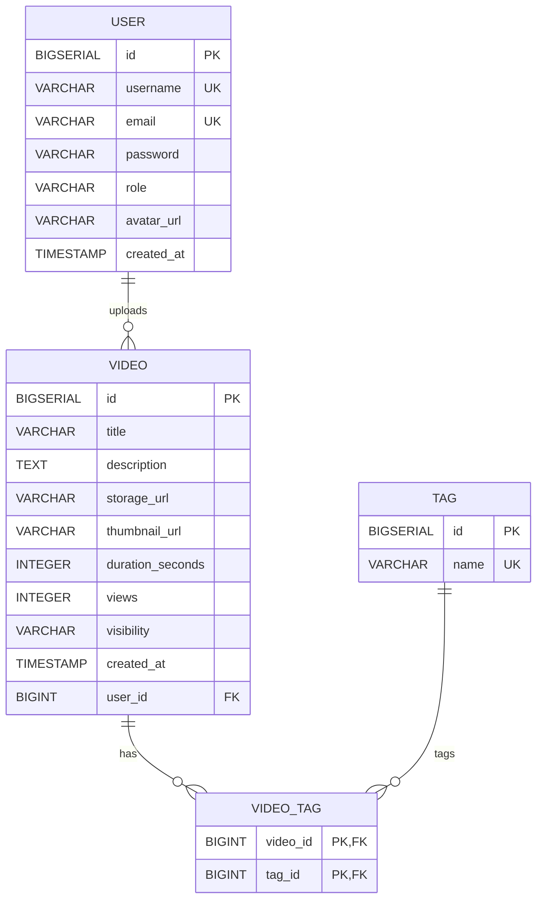

 

# PanHorAMix

> Final Project - Tasca S5.02

## Description

PanHorAMix is a web application where users can upload, discover and manage horizontal videos.

The application focuses on providing a simple platform dedicated to horizontal video content, allowing users to browse videos by category while administrators can moderate the platform.

This project is developed as the Final MVP for the IT Academy Java Backend course.

---

# Problem Statement

Most modern social platforms prioritize short vertical videos.

PanHorAMix aims to provide a simple platform focused on horizontal video content, allowing creators to publish their videos and users to easily discover them through categories and search.

The goal is not to compete with YouTube, but to build a complete MVP demonstrating a modern full-stack application.

---

# MVP Objectives

The first version of PanHorAMix will allow users to:

* Register an account
* Log in securely using JWT authentication
* Upload videos
* Edit their own videos
* Delete their own videos
* Browse all published videos
* Search videos by title
* Filter videos by category

Administrators will additionally be able to:

* Manage categories
* Delete any video
* Delete users

---

# Business Process

The main workflow of the application is:

1. A visitor registers.
2. The user logs in.
3. The user uploads a video.
4. The video becomes publicly available.
5. Other users can browse the video.
6. Users can search videos.
7. Users can filter videos by category.

---

# User Roles

## User

A regular user can:

* Register
* Log in
* Manage their own profile
* Upload videos
* Edit their own videos
* Delete their own videos
* Browse videos
* Search videos
* Filter videos by category

## Administrator

An administrator can:

* Delete any video
* Delete users
* Create categories
* Update categories
* Delete categories

---

# User Stories

## US-01

As a visitor, I want to register so that I can upload videos.

## US-02

As a user, I want to log in so that I can access my account.

## US-03

As a user, I want to access a home page after logging in so that I can start using PanHorAMix.

## US-04

As a user, I want to upload a video so that I can share content.

## US-05

As a user, I want to edit or delete my own videos so that I can keep my content updated.

## US-06

As a visitor, I want to browse published videos so that I can discover content.

## US-07

As a user, I want to search videos by title so that I can quickly find content.

## US-08

As a user, I want to filter videos by category so that I can discover related content.

## US-09

As an administrator, I want to manage categories so that videos remain properly organized.

## US-10

As an administrator, I want to delete inappropriate videos to keep the platform safe.

## US-11

As an administrator, I want to delete users when necessary.

---

# Technologies

## Frontend

* React
* React Router
* Axios

## Backend

* Java 21
* Spring Boot
* Spring Security
* JWT Authentication
* Spring Data JPA
* Hibernate
* Bean Validation
* OpenAPI (Swagger)

## Project Structure

```text
PanHorAMix
│
├── backend
│   ├── src
│   │   ├── main
│   │   │   ├── java/com/panhoramix/backend
│   │   │   │   ├── config
│   │   │   │   ├── controller
│   │   │   │   ├── dto
│   │   │   │   │   ├── request
│   │   │   │   │   └── response
│   │   │   │   ├── entity
│   │   │   │   ├── exception
│   │   │   │   ├── mapper
│   │   │   │   ├── repository
│   │   │   │   ├── security
│   │   │   │   ├── service
│   │   │   │   ├── validation
│   │   │   │   └── BackendApplication.java
│   │   │   └── resources
│   │   │       ├── db
│   │   │       │   └── migration
│   │   │       ├── static
│   │   │       ├── templates
│   │   │       └── application.properties
│   │   └── test
│   ├── pom.xml
│   └── ...
│
├── frontend
│
├── docs
│   ├── PanHorAMix-ERD.drawio
│   └── PanHorAMix-ERD.png
│
├── docker-compose.yml
└── README.md
```

## Database

* PostgreSQL

## Entity Relationships

- A user can upload multiple videos.
- A video belongs to one user.
- A video can have multiple tags.
- A tag can be associated with multiple videos.

## Entity Relationship Diagram (ERD)


## Database Migration

* Flyway

## Testing

* JUnit 5
* Mockito
* MockMvc

## DevOps

* Docker
* Docker Compose

---

# Planned Data Model

## User

* id
* username
* email
* password
* avatar
* role
* createdAt

## Video

* id
* title
* description
* videoUrl
* thumbnail
* duration
* uploadDate
* views
* userId
* categoryId

## Category

* id
* name

---

# Architecture

The backend will follow a layered architecture based on:

* Controller
* Service
* Repository
* Entity
* DTO
* Security
* Configuration

The frontend will consume the REST API using Axios.

---

# Future Improvements

The following features are intentionally excluded from the MVP:

* Comments
* Likes
* Favorites
* Playlists
* User subscriptions
* Notifications
* Live streaming
* Recommendation system
* Reporting system
* Advanced statistics

---

# Future Improvements

The current version of PanHorAMix is a Minimum Viable Product (MVP). The following features are planned for future releases:

## User Interaction

- Like videos
- Comment on videos
- Save favorite videos
- Subscribe to creators

## Content Management

- Create playlists
- Private and unlisted videos
- Video reports
- Content moderation tools

## Personalization

- Watch history
- Personalized recommendations
- Notifications
- User activity dashboard

## Analytics

- Advanced video statistics
- Creator analytics
- Most viewed videos
- Trending content

## Media

- Direct video upload
- Thumbnail generation
- Video transcoding
- Multiple video qualities (720p, 1080p, 4K)

# 🔐 Security Roadmap

Estas funcionalidades no forman parte del MVP, pero están previstas para futuras versiones de PanHorAMix.

## Authentication

☐ Logout (invalidar el token del dispositivo actual).

☐ Logout from all devices (invalidar todos los tokens del usuario).

☐ Refresh Token (renovación automática del JWT sin volver a introducir credenciales).

☐ Remember Me (sesiones de larga duración opcionales).

☐ Active Sessions (listar todos los dispositivos donde el usuario tiene una sesión iniciada).

☐ Device Management (cerrar sesión únicamente en un dispositivo concreto).

☐ Token Versioning (invalidación global de JWT mediante versión de token, evitando almacenar todos los tokens emitidos).

☐ Two-Factor Authentication (2FA).

☐ Social Login (Google, Apple, Microsoft...).

☐ Suspicious Login Detection (avisar cuando se inicia sesión desde un nuevo dispositivo o ubicación).

---

# Author

Eric Tarrés

IT Academy - Java Backend

Final Project (Tasca S5.02)

