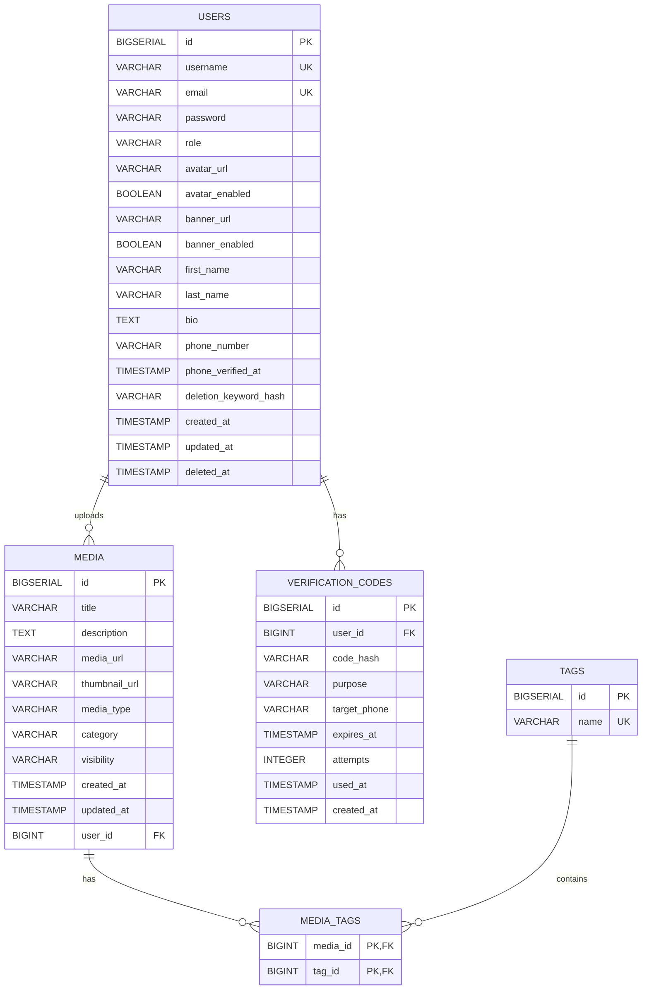

# PanHorAMix

> Final Project - Tasca S5.02

## Description

PanHorAMix is a web application where users can upload, discover and manage horizontal images and videos.

The application focuses on providing a simple platform dedicated to horizontal image and video content, allowing users to browse media by category while administrators can moderate the platform.

This project is developed as the Final MVP for the IT Academy Java Backend course.

---

# Problem Statement

Most modern social platforms prioritize short vertical videos.

PanHorAMix aims to provide a simple platform focused on horizontal video content, allowing creators to publish their videos and users to easily discover them through categories and search.

The goal is not to compete with YouTube, but to build a complete MVP demonstrating a modern full-stack application.

---

# MVP Objectives

The first version of PanHorAMix will allow users to:

* Register an account
* Log in securely using JWT authentication
* Upload images and videos
* Edit their own media
* Delete their own media
* Browse all published media
* Filter media by category

Administrators will additionally be able to:

* Manage role accounts
* Delete any media
* Delete users

---

# Business Process

The main workflow of the application is:

1. A visitor registers.
2. The user logs in.
3. The user uploads a media.
4. The media becomes publicly available.
5. Other users can browse the video.
6. Users can filter videos by category.

---

# User Roles

## User

A regular user can:

* Register
* Log in
* Manage their own profile
* Upload image or videos
* Edit their own media
* Delete their own media
* Browse videos
* Filter videos by category

## Administrator

An administrator can:

* Delete any media (image/video)
* Delete users
* Find any media by Title
* Change the account Role (User/Admin)


---

# User Stories

## US-01

As a visitor, I want to register so that I can upload videos.

## US-02

As a user, I want to log in so that I can access my account.

## US-03

As a user, I want to access a home page after logging in so that I can start using PanHorAMix.

## US-04

As a user, I want to upload an image or video so that I can share content.

## US-05

As a user, I want to edit or delete my own videos so that I can keep my content updated.

## US-06

As a visitor, I want to browse published videos so that I can discover content.

## US-07

As a user, I want to filter videos by category so that I can discover related content.

## US-08

As a administrator, I want to search videos by title so that I can quickly find content.

## US-09

As an administrator, I want to manage role of account

## US-10

As an administrator, I want to delete inappropriate videos to keep the platform safe.

## US-11

As an administrator, I want to delete users when necessary.

---

# Technologies

## Frontend

* React
* React Router
* Axios

## Backend

* Java 21
* Spring Boot
* Spring Security
* JWT Authentication
* Spring Data JPA
* Hibernate
* Bean Validation
* OpenAPI (Swagger)

## Database

* PostgreSQL
* Flyway

## Testing

* JUnit
* Mockito

## Infrastructure & Deployment

* Docker
* Render
* Cloudflare R2
* Cloudflare DNS / Domain
* Resend

## Development & Version Control

* Maven
* Git
* GitHub
* IntelliJ IDEA

## Project Structure

```text
PanHorAMix
│
├── backend
│   ├── src
│   │   ├── main
│   │   │   ├── java/com/panhoramix/backend
│   │   │   │   ├── config
│   │   │   │   ├── controller
│   │   │   │   ├── dto
│   │   │   │   │   ├── request
│   │   │   │   │   └── response
│   │   │   │   ├── entity
│   │   │   │   │   ├── enums
│   │   │   │   │   ├── Media
│   │   │   │   │   ├── User
│   │   │   │   │   └── VerificationCode
│   │   │   │   ├── exception
│   │   │   │   ├── mapper
│   │   │   │   ├── repository
│   │   │   │   ├── security
│   │   │   │   │   ├── config
│   │   │   │   │   └── jwt
│   │   │   │   ├── service
│   │   │   │   │   └── impl
│   │   │   │   │       ├── CloudflareStorageService
│   │   │   │   │       ├── AdminService
│   │   │   │   │       ├── CurrentUserService
│   │   │   │   │       ├── EmailService
│   │   │   │   │       ├── EmailVerificationService
│   │   │   │   │       ├── FileStorageService
│   │   │   │   │       ├── MediaService
│   │   │   │   │       ├── ProfileImageService
│   │   │   │   │       └── UserService
│   │   │   │   ├── validation
│   │   │   │   └── BackendApplication
│   │   │   │
│   │   │   └── resources
│   │   │       ├── db.migration
│   │   │       ├── static
│   │   │       ├── templates
│   │   │       └── application.properties
│   │   │
│   │   └── test
│   │
│   ├── Dockerfile
│   ├── HELP.md
│   ├── mvnw
│   ├── mvnw.cmd
│   └── pom.xml
│
├── frontend
│   ├── public
│   ├── src
│   │   ├── api
│   │   ├── assets
│   │   ├── components
│   │   │   ├── common
│   │   │   │   ├── SceneMenu
│   │   │   │   ├── Toast
│   │   │   │   ├── FrameButton.css
│   │   │   │   ├── FrameButton.jsx
│   │   │   │   ├── PHButton.css
│   │   │   │   ├── PHButton.jsx
│   │   │   │   ├── PHInput.css
│   │   │   │   └── PHInput.jsx
│   │   │   ├── layout
│   │   │   │   ├── Navbar
│   │   │   │   └── AppLayout.jsx
│   │   │   ├── profile
│   │   │   ├── scene
│   │   │   └── ui
│   │   ├── context
│   │   ├── pages
│   │   │   ├── Admin
│   │   │   ├── Auth
│   │   │   ├── EditProfile
│   │   │   ├── Home
│   │   │   │   ├── components
│   │   │   │   ├── HomePage.css
│   │   │   │   └── HomePage.jsx
│   │   │   ├── Landing
│   │   │   ├── Login
│   │   │   ├── Media
│   │   │   ├── Profile
│   │   │   ├── PublicProfile
│   │   │   ├── Register
│   │   │   └── Upload
│   │   │       ├── components
│   │   │       ├── UploadPage.css
│   │   │       └── UploadPage.jsx
│   │   ├── router
│   │   ├── styles
│   │   ├── App.jsx
│   │   └── main.jsx
│   │
│   ├── .gitignore
│   ├── eslint.config.js
│   ├── index.html
│   ├── package.json
│   ├── package-lock.json
│   ├── README.md
│   └── vite.config.js
│
├── docs
│   ├── PanHorAMix-ERD.drawio
│   └── PanHorAMix-ERD.png
│
├── docker-compose.yml
└── README.md
```

## Entity Relationships
* A user can upload multiple media (images and videos).
* Each media belongs to one user.
* Each media is associated with one category.
* A category can be associated with multiple media.

## Entity Relationship Diagram (ERD)


```mermaid
erDiagram

    USERS ||--o{ MEDIA : uploads
    USERS ||--o{ VERIFICATION_CODES : has
    MEDIA ||--o{ MEDIA_TAGS : has
    TAGS ||--o{ MEDIA_TAGS : contains

    USERS {
        BIGSERIAL id PK
        VARCHAR username UK
        VARCHAR email UK
        VARCHAR password
        VARCHAR role
        VARCHAR avatar_url
        BOOLEAN avatar_enabled
        VARCHAR banner_url
        BOOLEAN banner_enabled
        VARCHAR first_name
        VARCHAR last_name
        TEXT bio
        VARCHAR phone_number
        TIMESTAMP phone_verified_at
        VARCHAR deletion_keyword_hash
        TIMESTAMP created_at
        TIMESTAMP updated_at
        TIMESTAMP deleted_at
    }

    MEDIA {
        BIGSERIAL id PK
        VARCHAR title
        TEXT description
        VARCHAR media_url
        VARCHAR thumbnail_url
        VARCHAR media_type
        VARCHAR category
        VARCHAR visibility
        TIMESTAMP created_at
        TIMESTAMP updated_at
        BIGINT user_id FK
    }

    VERIFICATION_CODES {
        BIGSERIAL id PK
        BIGINT user_id FK
        VARCHAR code_hash
        VARCHAR purpose
        VARCHAR target_phone
        TIMESTAMP expires_at
        INTEGER attempts
        TIMESTAMP used_at
        TIMESTAMP created_at
    }

    TAGS {
        BIGSERIAL id PK
        VARCHAR name UK
    }

    MEDIA_TAGS {
        BIGINT media_id PK,FK
        BIGINT tag_id PK,FK
    }
```
---

# Planned Data Model

## User

* id
* username
* email
* password
* role
* avatarUrl
* avatarEnabled
* bannerUrl
* bannerEnabled
* firstName
* lastName
* bio
* phoneNumber
* phoneVerifiedAt
* deletionKeywordHash
* createdAt
* updatedAt
* deletedAt

## Media

* id
* title
* description
* mediaUrl
* thumbnailUrl
* mediaType
* category
* visibility
* userId
* createdAt
* updatedAt

## VerificationCode

* id
* userId
* codeHash
* purpose
* targetPhone
* expiresAt
* attempts
* usedAt
* createdAt

## Tag

* id
* name

## MediaTag

* mediaId
* tagId

---

# Architecture

The backend will follow a layered architecture based on:

* Controller
* Service
* Repository
* Entity
* DTO
* Security
* Configuration

The frontend will consume the REST API using Axios.

---

## Media Requirements (MVP)

To preserve the cinematic identity of PanHorAMix, every uploaded video or image must meet the following requirements.

### 🎥 Videos

| Requirement | Value |
|-------------|-------|
| Orientation | Landscape only (width > height) |
| Minimum Resolution | 1920 × 1080 (Full HD) |
| Maximum Duration | 5 minutes |
| Maximum File Size | 700 MB |
| Supported Formats | MP4 (.mp4), MOV (.mov) |

### 📸 Images

| Requirement | Value |
|-------------|-------|
| Orientation | Landscape only (width > height) |
| Minimum Resolution | 1920 × 1080 (Full HD) |
| Maximum File Size | 25 MB |
| Supported Formats | JPG (.jpg, .jpeg), PNG (.png) |

Media that does not meet these requirements will be rejected before upload.

Official PHAM validation message:

🎬 Scene Rejected

Cinema deserves landscape.

---

# Future Improvements

The following features are intentionally excluded from the MVP:

* Comments
* Likes
* Favorites
* Playlists
* User subscriptions
* Notifications
* Live streaming
* Recommendation system
* Reporting system
* Advanced statistics

---

# Future Improvements

The current version of PanHorAMix is a Minimum Viable Product (MVP). The following features are planned for future releases:

## User Interaction

- Like videos
- Comment on videos
- Save favorite videos
- Subscribe to creators

## Content Management

- Create playlists
- Video reports
- Content moderation tools

## Personalization

- Watch history
- Personalized recommendations
- Notifications
- User activity dashboard

## Analytics

- Advanced video statistics
- Creator analytics
- Most viewed videos
- Trending content

## Media

- Direct video upload
- Thumbnail generation
- Video transcoding
- Multiple video qualities (720p, 1080p, 4K)

# 🔐 Security Roadmap

These features are not part of the MVP, but they are planned for future versions of PanHorAMix.

## Authentication

☐ Logout (invalidar el token del dispositivo actual).

☐ Logout from all devices (invalidar todos los tokens del usuario).

☐ Refresh Token (renovación automática del JWT sin volver a introducir credenciales).

☐ Remember Me (sesiones de larga duración opcionales).

☐ Active Sessions (listar todos los dispositivos donde el usuario tiene una sesión iniciada).

☐ Device Management (cerrar sesión únicamente en un dispositivo concreto).

☐ Token Versioning (invalidación global de JWT mediante versión de token, evitando almacenar todos los tokens emitidos).

☐ Two-Factor Authentication (2FA).

☐ Social Login (Google, Apple, Microsoft...).

☐ Suspicious Login Detection (avisar cuando se inicia sesión desde un nuevo dispositivo o ubicación).

---

# Author

Eric Tarrés

IT Academy - Java Backend

Final Project (Tasca S5.02)

